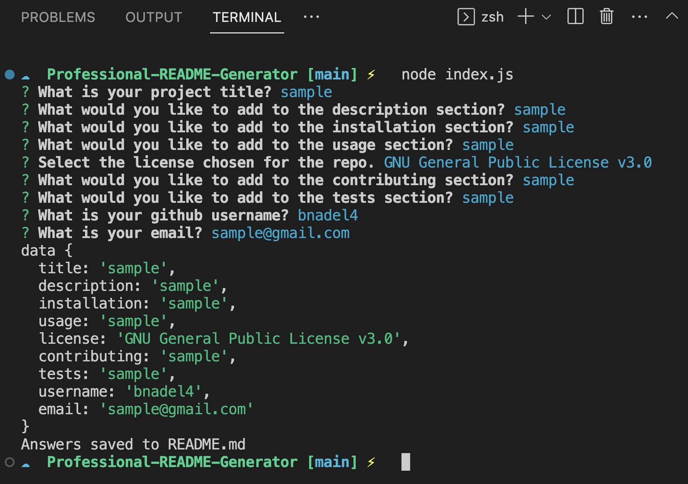
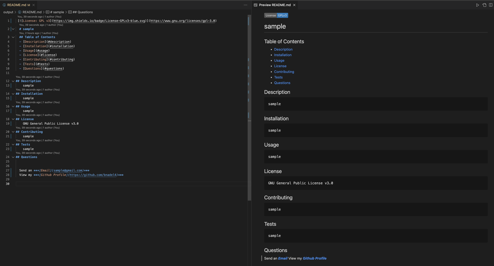

 # Professional README Generator

## Description

An open source command line application that accepts user input to generate professional README files. 

## Table of Contents (Optional)

- [Installation](#installation)
- [Usage](#usage)
- [Credits](#credits)
- [License](#license)

## Installation

Clone the repo to your local system.

## Usage

[Video Demo](https://drive.google.com/file/d/1st_alocFe6876G0LlSIncq4ZL5Tv6BYI/view)

## Credits

[https://opensource.org/licenses/](https://opensource.org/licenses/)

## License

 

